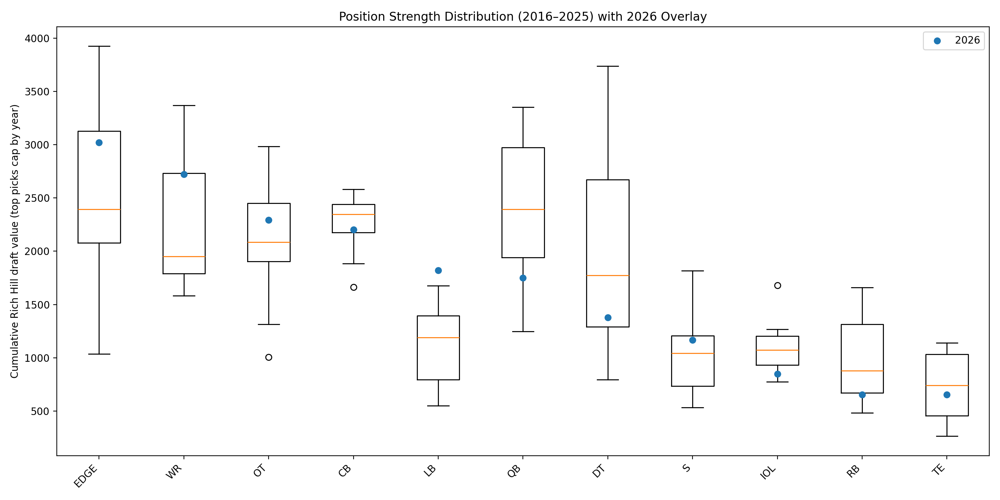
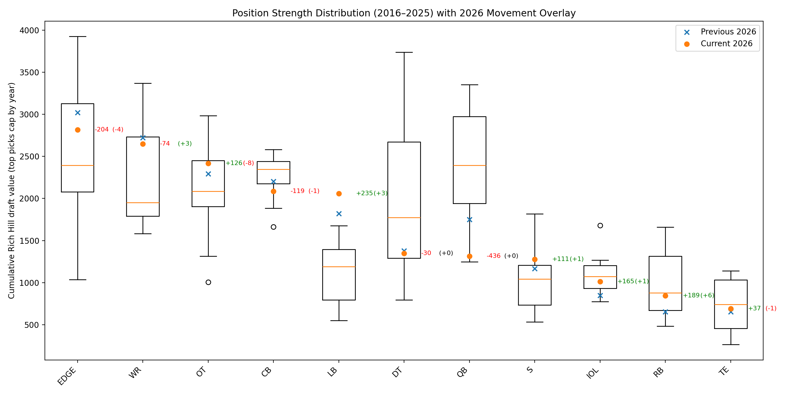
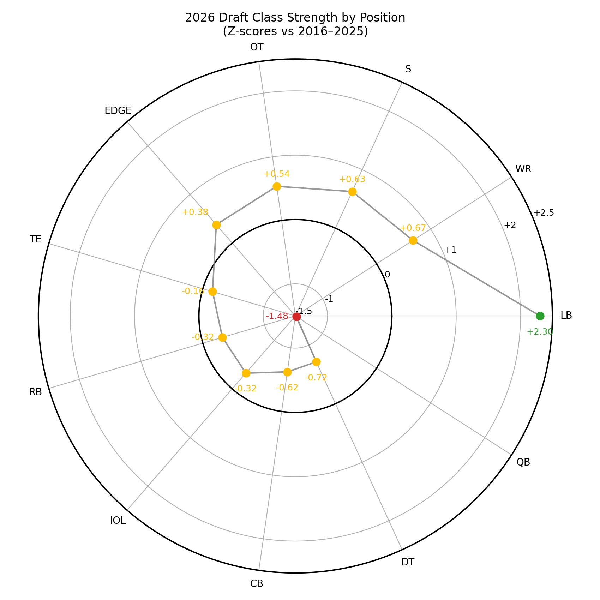

# NFL Draft Class Strength by Position (2016–2026)

## Overview

This project answers a simple but often hand-waved question:

> **How strong is a given NFL draft class by position (QB, WR, EDGE, etc.) compared to history?**

Rather than relying on narrative or isolated prospect rankings, this analysis uses **draft capital as revealed preference** — how teams actually value positions in aggregate — and compares each draft class to historical baselines.

The primary focus is on evaluating the **2026 draft class** in context, using drafts from **2016–2025** as the historical reference window.

---

## Core Idea

A draft class can be “strong” at a position in two different ways:

- **Elite talent at the top** (high-value early picks)
- **Depth throughout the draft** (many draftable players accumulating value)

This project captures *both* by aggregating **Rich Hill draft value** across positions and standardizing results relative to history.

---

## Methodology (High Level)

For each draft year:

1. Read the consensus big board  
2. Cap the board to that year’s total draft picks  
3. Map rank → pick → Rich Hill value  
4. Aggregate by position:
   - cumulative draft value  
   - number of players  
   - average value per player  

For historical comparison (2016–2025):

5. Build per-position distributions of cumulative value  
6. Compare 2026 directly against those distributions  

---

## Visualizations

### 2026 vs History (Boxplots + overlay)


This shows where each position group falls relative to the last decade.

---

### 2026 Movement (Snapshot Comparison)


This tracks how the 2026 class is changing over time.

- **X marker** = previous snapshot  
- **Dot** = current snapshot  
- **Green/red number** = change in total draft capital  
- **( ) number** = change in number of draftable players  

---

### 2026 Position Strength (Radar z-scores)


A high-level summary of which positions are strong or weak vs history.

---

## Key Insights (Latest Update)

- **LB (+235, +3)**: Rising in both value and depth  
- **RB (+189, +6)**: Increasing number of draftable players  
- **OT (+126, -8)**: More top-heavy (higher value, less depth)  
- **WR (-74, +3)**: Deeper but less concentrated at the top  
- **EDGE (-204, -4)**: Declining in both depth and value  
- **QB (-436, 0)**: Significant drop in value without loss of depth  

---

## Why This Approach Works

- Uses **draft capital**, not opinion, as the valuation signal  
- Separates **depth vs top-end strength**  
- Anchors analysis in **historical context**  
- Updates dynamically as rankings change  

---

## Project Structure

```text
nfl-draft-analytics/
  data/
    raw/
    reference/
    processed/
  src/
    make_position_summary.py
    combine_position_summaries.py
    score_2026_vs_history.py
    plot_*.py
  reports/
    *.png
